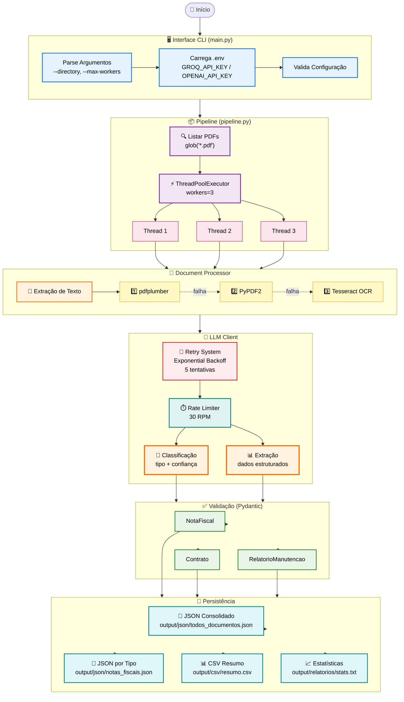
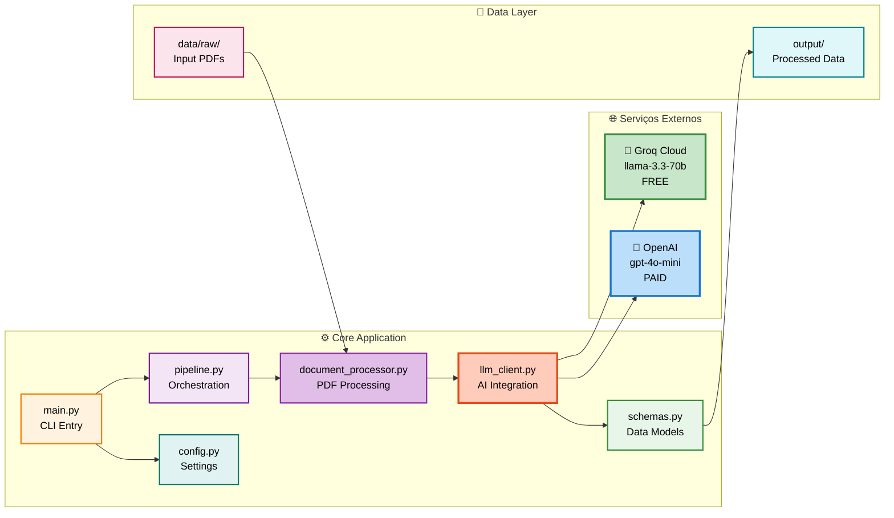
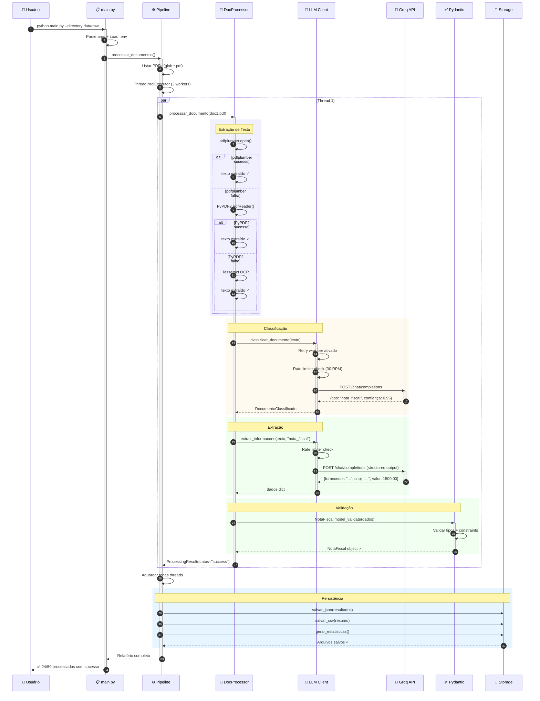
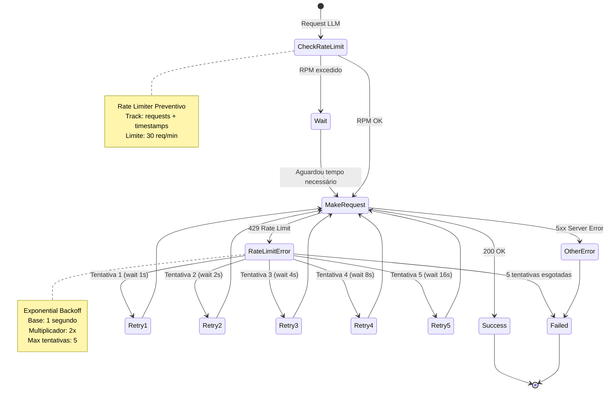
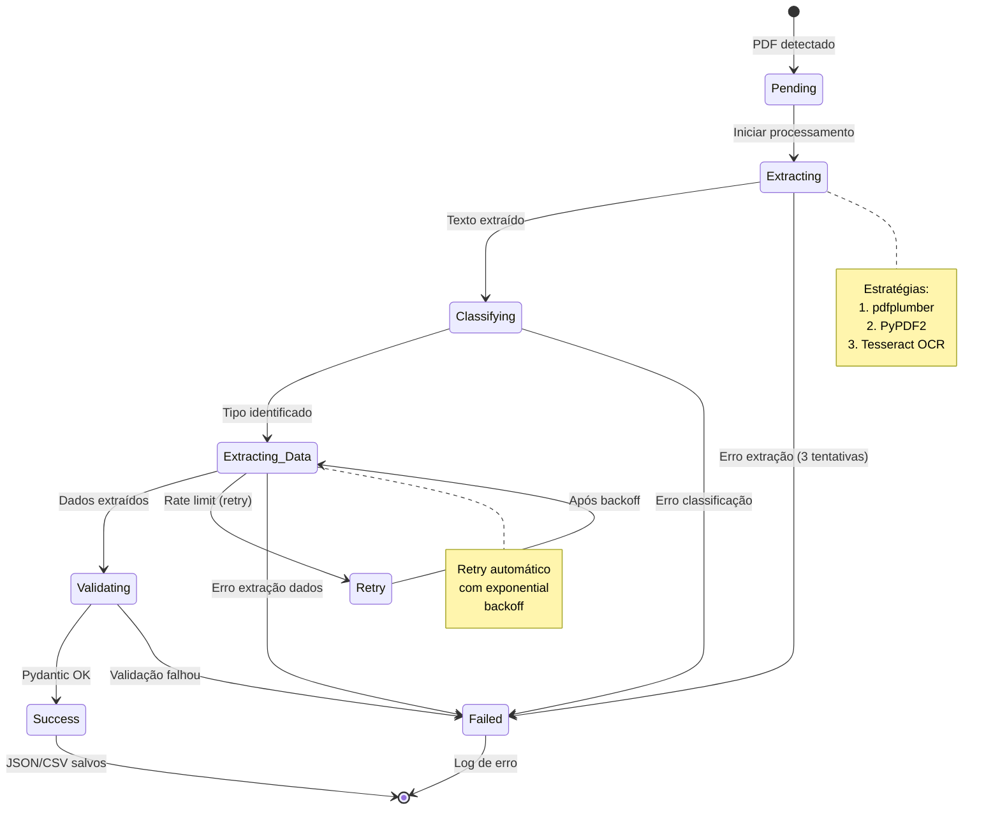

#  Documentação Técnica

## Arquitetura Detalhada

### Fluxo de Dados Completo



### Diagrama de Componentes



### Sequência de Processamento (1 Documento)



### Fluxo de Retry e Rate Limiting



### Diagrama de Estados do Documento


           - Response format: NotaFiscal | Contrato | ...   
           - Temperature: 0                                  
         Response:                                           
           - Dados estruturados validados por Pydantic      

                  
                  

              SCHEMAS.PY (Validação)                          
                                                              
  Pydantic Models:                                           
    > NotaFiscal                                          
        > fornecedor: str                                
        > cnpj: str                                      
        > itens: List[ItemNotaFiscal]                   
        > valor_total: float                            
                                                             
    > Contrato                                            
        > contratante: str                               
        > contratado: str                                
        > valor_mensal: float                            
                                                             
    > RelatorioManutencao                                 
         > tecnico_responsavel: str                       
         > equipamento: str                               
         > solucao_aplicada: str                          

                  
                  

                         SAÍDA                                
  output/                                                     
   resultados_20240301_143022.json                       
   nota_fiscal_20240301_143022.json                      
   contrato_20240301_143022.json                         
   relatorio_manutencao_20240301_143022.json             
   resumo_20240301_143022.csv                            
   estatisticas_20240301_143022.txt                      

```

## Componentes Principais

### 1. Pipeline (pipeline.py)

**Responsabilidades:**
- Orquestração do fluxo completo
- Gerenciamento de threads paralelas
- Agregação de resultados
- Persistência múltiplos formatos

**Métodos principais:**
- `executar()`: Ponto de entrada principal
- `processar_lote()`: Processa batch com ThreadPoolExecutor
- `salvar_resultados()`: Persiste em JSON, CSV e TXT
- `_gerar_relatorio_estatisticas()`: Gera métricas

**Performance:**
- Max workers: 3 (configurável)
- Batch size: 10 (configurável)
- Progress bar: tqdm

### 2. Document Processor (document_processor.py)

**Responsabilidades:**
- Extração de texto de PDFs
- Coordenação LLM
- Validação de dados
- Tratamento de erros individuais

**Estratégias de extração:**
```python
# Primary: pdfplumber
with pdfplumber.open(pdf) as pdf:
    text = page.extract_text()

# Fallback: PyPDF2
reader = PyPDF2.PdfReader(file)
text = page.extract_text()
```

**Tratamento de erros:**
- Try-catch em cada etapa
- Retorna ProcessingResult com status
- Logging detalhado

### 3. LLM Client (llm_client.py)

**Responsabilidades:**
- Comunicação com OpenAI API
- Structured outputs
- Prompting especializado

**Configuração:**
```python
client = OpenAI(api_key=os.getenv("OPENAI_API_KEY"))
model = "gpt-4o-mini"  # Configurável
temperature_classification = 0.1
temperature_extraction = 0
```

**Structured Outputs:**
```python
response = client.beta.chat.completions.parse(
    model=self.model,
    messages=[...],
    response_format=NotaFiscal,  # Pydantic model
    temperature=0
)
```

### 4. Schemas (schemas.py)

**Validação Pydantic:**
- Type hints rigorosos
- Descrições para o LLM
- Validação automática
- Serialização JSON

**Exemplo:**
```python
class NotaFiscal(BaseModel):
    tipo_documento: Literal["nota_fiscal"] = "nota_fiscal"
    fornecedor: str = Field(description="Nome do fornecedor")
    cnpj: str = Field(description="CNPJ do fornecedor")
    itens: List[ItemNotaFiscal]
    valor_total: float
```

## Decisões de Design

### 1. Por que ThreadPoolExecutor?

**Análise:**
-  I/O-bound (PDF reading + API calls)
-  GIL release durante I/O
-  Simples de implementar
-  Controle de concorrência

**Alternativas consideradas:**
-  Multiprocessing: Overhead de serialização
-  AsyncIO: Complexidade adicional
-  Celery: Over-engineering para escopo atual

### 2. Por que múltiplos outputs?

**Justificativa:**
1. **JSON consolidado**: Auditoria completa
2. **JSONs por tipo**: Integração ERP
3. **CSV**: Análise em Excel/BI
4. **TXT stats**: Overview rápido

### 3. Por que two-step (classificação + extração)?

**Vantagens:**
-  Prompts especializados
-  Melhor debugging
-  Flexibilidade (modelos diferentes por etapa)
-  Custo controlado

**Desvantagens:**
-  2x chamadas API (mitigado: classificação usa menos tokens)

### 4. Por que Pydantic?

**Benefícios:**
-  Validação runtime
-  Type safety
-  Integração nativa OpenAI
-  Documentação implícita

## Otimizações

### Custo

1. **Modelo econômico**: gpt-4o-mini
2. **Truncamento**: Limita tokens na classificação
3. **Temperature 0**: Reduz variabilidade
4. **Batch processing**: Amortiza overhead

### Performance

1. **Paralelização**: 3 workers simultâneos
2. **Fallback rápido**: Múltiplas estratégias PDF
3. **Progress tracking**: tqdm para UX

### Robustez

1. **Try-catch granular**: Por documento
2. **Logging detalhado**: Debug facilitado
3. **Validação Pydantic**: Garante integridade
4. **Múltiplos outputs**: Redundância

## Métricas

### Estimativas (50 documentos)

**Custo:**
- Input tokens: ~100k = $0.015
- Output tokens: ~50k = $0.030
- **Total: ~$0.045**

**Tempo:**
- Extração PDF: ~0.5s/doc
- LLM classificação: ~1s/doc
- LLM extração: ~2s/doc
- **Total: ~3.5s/doc média**

**Escalabilidade:**
- 1000 docs: ~58 minutos (~$0.90)
- 10000 docs: ~9.7 horas (~$9.00)
- 100000 docs: ~4 dias (~$90.00)

## Manutenção

### Logs

**Localização:** Console + arquivo opcional

**Níveis:**
- DEBUG: Detalhes de implementação
- INFO: Progresso normal
- WARNING: Problemas não críticos
- ERROR: Falhas que requerem atenção

### Monitoramento

**Métricas chave:**
- Taxa de sucesso (target: >95%)
- Tempo médio (target: <5s)
- Custo por documento (target: <$0.001)

### Troubleshooting

**Problemas comuns:**
1. **Rate limiting**: Reduzir max_workers
2. **PDF corrompido**: Logs identificam arquivo
3. **Extração incorreta**: Ajustar prompts
4. **Custo alto**: Trocar para modelo menor em classificação

## Extensões Futuras

### 1. Suporte a novos tipos de documento

```python
# 1. Adicionar schema em schemas.py
class NotaCreditoDebito(BaseModel):
    ...

# 2. Atualizar DOCUMENT_SCHEMAS
DOCUMENT_SCHEMAS["nota_credito_debito"] = NotaCreditoDebito

# 3. Adicionar instruções em llm_client.py
```

### 2. OCR para imagens

```python
# Integrar pytesseract ou Azure Document Intelligence
from pytesseract import image_to_string
texto = image_to_string(Image.open(image_path))
```

### 3. Fila de processamento

```python
# Integrar com Celery + Redis
@celery.task
def processar_documento_async(caminho):
    ...
```

### 4. API REST

```python
# FastAPI endpoint
@app.post("/processar")
async def processar_upload(file: UploadFile):
    ...
```

## Referências

- [OpenAI Structured Outputs](https://platform.openai.com/docs/guides/structured-outputs)
- [Pydantic Documentation](https://docs.pydantic.dev/)
- [ThreadPoolExecutor](https://docs.python.org/3/library/concurrent.futures.html)

