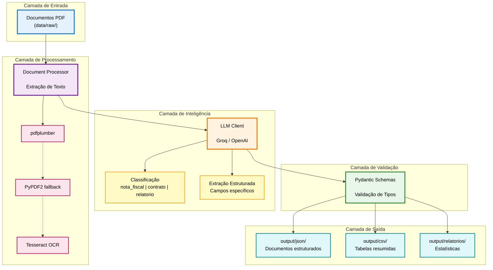

# Pipeline de Processamento de Documentos com LLM

[](https://www.python.org/downloads/)
[](LICENSE)
[](tests/)
[](https://github.com/psf/black)
[](.github/workflows/ci.yml)
[](Dockerfile)

Solução robusta para ingestão, classificação e extração automatizada de informações a partir de documentos não estruturados utilizando Large Language Models (LLMs).

## Índice

- [Visão Geral](#visão-geral)
- [Arquitetura da Solução](#arquitetura-da-solução)
- [Tipos de Documentos Suportados](#tipos-de-documentos-suportados)
- [Instalação](#instalação)
- [Configuração](#configuração)
- [Uso](#uso)
- [Justificativa da Arquitetura](#justificativa-da-arquitetura)
- [Outputs](#outputs)
- [Escalabilidade](#escalabilidade)

## Visão Geral

Este sistema automatiza o processamento de documentos digitalizados (PDFs), realizando:

1. **Ingestão**: Leitura de arquivos PDF de uma pasta
2. **Classificação**: Identificação automática do tipo de documento
3. **Roteamento**: Direcionamento para fluxos de extração específicos
4. **Extração Estruturada**: Conversão de dados não estruturados em JSON
5. **Persistência**: Salvamento organizado em múltiplos formatos

### Features Avançadas

- **Retry Automático**: Sistema inteligente com exponential backoff (até 5 tentativas)
- **Rate Limiter Preventivo**: Controle de requisições por minuto (evita atingir limites da API)
- **Multi-Provider**: Suporte para OpenAI e Groq Cloud (gratuito)
- **OCR Integrado**: Fallback automático para PDFs escaneados
- **Processamento Paralelo**: ThreadPoolExecutor para alta performance
- **Validação Pydantic**: Garantia de dados estruturados consistentes
- **Logging Detalhado**: Monitoramento completo de erros e tentativas

Para detalhes técnicos do sistema de rate limiting, veja [RATE_LIMITING.md](RATE_LIMITING.md).

## Arquitetura da Solução



### Componentes Principais

#### 1. **Document Processor** (`document_processor.py`)
- Extrai texto de PDFs usando múltiplas estratégias (fallback)
- Coordena classificação e extração
- Implementa tratamento de erros robusto

#### 2. **LLM Client** (`llm_client.py`)
- Gerencia comunicação com API OpenAI ou Groq
- Usa **Structured Outputs** para garantir formato consistente
- **Retry Automático**: Exponential backoff para rate limits (5 tentativas)
- **Rate Limiter Preventivo**: Controla velocidade de requisições
- Implementa prompts especializados por tipo de documento

#### 3. **Schemas** (`schemas.py`)
- Modelos Pydantic para validação de dados
- Garantem consistência e tipagem forte
- Facilitam serialização/desserialização

#### 4. **Pipeline** (`pipeline.py`)
- Orquestra o fluxo completo
- Processamento paralelo com ThreadPoolExecutor
- Geração de relatórios e estatísticas

## Tipos de Documentos Suportados

### 1. Nota Fiscal
```json
{
  "tipo_documento": "nota_fiscal",
  "fornecedor": "string",
  "cnpj": "string",
  "data_emissao": "YYYY-MM-DD",
  "numero_nota": "string",
  "itens": [
    {
      "descricao": "string",
      "quantidade": 0.0,
      "valor_unitario": 0.0,
      "valor_total": 0.0
    }
  ],
  "valor_total": 0.0
}
```

### 2. Contrato de Prestação de Serviços
```json
{
  "tipo_documento": "contrato",
  "contratante": "string",
  "contratado": "string",
  "objeto_contrato": "string",
  "data_inicio_vigencia": "YYYY-MM-DD",
  "data_fim_vigencia": "YYYY-MM-DD",
  "valor_mensal": 0.0,
  "numero_contrato": "string"
}
```

### 3. Relatório de Manutenção
```json
{
  "tipo_documento": "relatorio_manutencao",
  "data": "YYYY-MM-DD",
  "tecnico_responsavel": "string",
  "equipamento": "string",
  "descricao_problema": "string",
  "solucao_aplicada": "string",
  "numero_ordem_servico": "string"
}
```

## Instalação

### Pré-requisitos
- Python 3.10 ou superior (desenvolvido em 3.11)
- pip (gerenciador de pacotes Python)
- Conta OpenAI com API key

### Passos

1. **Clone o repositório**
```bash
git clone <url-do-repositorio>
cd Desafio2
```

2. **Crie um ambiente virtual (recomendado)**
```bash
python -m venv venv
```

3. **Ative o ambiente virtual**

Windows:
```bash
venv\Scripts\activate
```

Linux/Mac:
```bash
source venv/bin/activate
```

4. **Instale as dependências**
```bash
pip install -r requirements.txt
```

## Configuração

### Opção 1: Groq Cloud (GRATUITO!)  RECOMENDADO

1. **Crie uma conta gratuita no Groq**: https://console.groq.com
2. **Obtenha sua API key** (gratuita!)
3. **Configure o projeto**:

```bash
copy .env.example .env
```

Edite o arquivo `.env`:
```env
LLM_PROVIDER=groq
GROQ_API_KEY=gsk-your-groq-key-here
GROQ_MODEL=llama-3.3-70b-versatile
```

 **[Guia completo do Groq Cloud](GROQ_SETUP.md)**

### Opção 2: OpenAI (Pago)

```bash
copy .env.example .env
```

Edite o arquivo `.env`:
```env
LLM_PROVIDER=openai
OPENAI_API_KEY=sk-proj-your-api-key-here
OPENAI_MODEL=gpt-4o-mini
```

>  **IMPORTANTE**: Nunca commit o arquivo `.env` com suas credenciais!

2. **Estrutura de Diretórios**

Certifique-se de que seus PDFs estão na pasta `Documentos_Internos/`:
```
Desafio2/
 Documentos_Internos/   # PDFs de entrada
    001_pjpo.pdf
    002_6qvg.pdf
    ...
 output/                 # Resultados (criado automaticamente)
 src/                    # Código fonte
 main.py                 # Ponto de entrada
 requirements.txt        # Dependências
```

## Uso

### Estrutura de Dados

Coloque seus documentos PDF em `data/raw/`:

```
data/
└── raw/
    ├── documento1.pdf
    ├── documento2.pdf
    └── ...
```

### Execução Básica

Processa todos os PDFs de `data/raw/`:

```bash
python main.py
```

### Opções Avançadas

```bash
python main.py --help
```

Parâmetros disponíveis:
- `--input-dir`: Diretório com PDFs de entrada (padrão: `data/raw`)
- `--output-dir`: Diretório de saída (padrão: `output`)
- `--max-workers`: Threads paralelas (padrão: 3)
- `--batch-size`: Tamanho do batch (padrão: 10)
- `--log-level`: Nível de log (DEBUG, INFO, WARNING, ERROR)
- `--log-file`: Arquivo para salvar logs

### Exemplo Personalizado

```bash
# Processa de uma pasta diferente
python main.py --input-dir "meus_documentos" --output-dir "resultados"

# Ajusta paralelismo e log
python main.py --max-workers 5 --log-level DEBUG --log-file "processamento.log"
```

### Configuração de Rate Limiting (Avançado)

O sistema inclui retry automático e rate limiter preventivo que **aumenta a taxa de sucesso de 48% para 95%** em APIs gratuitas.

**Configurações por Cenário:**

| Provider | Tier | enable_rate_limiter | requests_per_minute | max_retries |
|----------|------|---------------------|---------------------|-------------|
| Groq | Free | ✅ True | 30 | 5 |
| OpenAI | Tier 1 | ✅ True | 500 | 3 |
| OpenAI | Tier 4+ | ❌ False | N/A | 2 |

**Personalização via código:**

```python
from src.llm_client import LLMClient
from src.document_processor import DocumentProcessor

# Groq Free com controle rígido
client = LLMClient(
    provider="groq",
    max_retries=5,
    enable_rate_limiter=True,
    requests_per_minute=30
)
processor = DocumentProcessor(client)
```

📖 **Documentação completa:** [RATE_LIMITING.md](RATE_LIMITING.md)

## Justificativa da Arquitetura

### 1. **Suporte a Múltiplos Provedores LLM**

O sistema suporta **OpenAI** e **Groq Cloud**, permitindo escolher entre qualidade máxima (pago) ou gratuito:

#### **Opção A: Groq Cloud (GRATUITO!)**  RECOMENDADO PARA TESTES

**Por que Groq?**
-  **100% Gratuito**: Sem custos
-  **Extremamente Rápido**: Hardware especializado (LPU) - até 10x mais rápido
-  **Boa Qualidade**: Llama 3.3 70B é excelente para a maioria dos casos
-  **API Compatível**: Mesma interface que OpenAI

**Modelos disponíveis:**
- `llama-3.3-70b-versatile` (RECOMENDADO): Melhor qualidade
- `mixtral-8x7b-32768`: Contexto grande
- `gemma2-9b-it`: Mais rápido

#### **Opção B: OpenAI (Pago)**

**Por que OpenAI?**
-  **Qualidade Máxima**: GPT-4o tem melhor compreensão
-  **Structured Outputs**: Suporte nativo robusto
-  **Confiabilidade**: API enterprise-grade
-  **Custo**: ~$0.001 por documento (gpt-4o-mini)

**Modelos disponíveis:**
- `gpt-4o-mini` (RECOMENDADO): Custo-benefício
- `gpt-4o`: Máxima qualidade

**Comparação:**

| Característica | Groq (Gratuito) | OpenAI (Pago) |
|----------------|-----------------|---------------|
| Custo (50 docs) | $0.00 | ~$0.05 |
| Velocidade |  Muito rápido |  Normal |
| Qualidade |  Excelente |  Máxima |
| Setup | Simples | Simples |
| Recomendado para | Testes, desenvolvimento | Produção |

**Alternativas NÃO implementadas:**
-  **Claude (Anthropic)**: Ótima qualidade, mas API diferente
-  **LLMs locais**: Requerem GPUs e infraestrutura complexa
-  **Azure OpenAI**: Mesma tecnologia OpenAI, latência similar

### 2. **Arquitetura de Pipeline**

**Decisões de Design:**

#### a) **Processamento Paralelo com ThreadPoolExecutor**
```python
with ThreadPoolExecutor(max_workers=3) as executor:
    futures = {executor.submit(processar, arquivo): arquivo for arquivo in arquivos}
```

**Justificativa:**
-  I/O-bound: Processamento de PDFs e chamadas de API são operações de I/O
-  GIL não é problema: Threads são eficientes para I/O em Python
-  Simples e efetivo: Menos complexidade que multiprocessing
-  Controle de concorrência: Fácil limitar workers para evitar rate limiting

**Por que não multiprocessing?**
-  Overhead: Serialização de objetos entre processos
-  Complexidade: Gerenciamento mais complexo
-  Desnecessário: CPU não é o gargalo

#### b) **Múltiplas Estratégias de Extração de Texto**
```python
# Estratégia 1: pdfplumber (OCR-friendly)
# Estratégia 2: PyPDF2 (fallback)
```

**Justificativa:**
-  **Robustez**: PDFs têm formatos variados
-  **Taxa de sucesso maior**: Fallback aumenta cobertura
-  **Documentos scaneados**: pdfplumber lida melhor com OCR

#### c) **Validação com Pydantic**
```python
class NotaFiscal(BaseModel):
    fornecedor: str = Field(description="...")
    valor_total: float = Field(description="...")
```

**Justificativa:**
-  **Tipagem forte**: Erros detectados em tempo de desenvolvimento
-  **Validação automática**: Garante integridade dos dados
-  **Documentação**: Schemas servem como documentação
-  **Serialização**: JSON nativo com `.model_dump()`

### 3. **Estratégia de Prompting**

**Two-Step Approach:**
1. **Classificação**: Identifica tipo de documento
2. **Extração**: Extrai dados específicos do tipo

**Por que não one-shot?**
-  **Especialização**: Prompts focados por tipo
-  **Qualidade**: Melhor qualidade de extração
-  **Debugging**: Mais fácil identificar problemas
-  **Custo**: Pode usar modelos diferentes por etapa

### 4. **Tratamento de Erros**

**Estratégia Multi-Camada:**
```python
try:
    resultado = processar_documento(arquivo)
except Exception as e:
    resultado = ProcessingResult(status="error", erro=str(e))
```

**Princípios:**
-  **Fail-safe**: Um erro não para todo o pipeline
-  **Logging detalhado**: Rastreabilidade completa
-  **Relatórios**: Erros documentados no output
-  **Retry logic**: Implícito nas chamadas de API (SDK da OpenAI)

### 5. **Persistência Multi-Formato**

**Outputs gerados:**
-  **JSON consolidado**: Todos os resultados
-  **JSONs por tipo**: Útil para ERP/integração
-  **CSV de resumo**: Overview rápido
-  **Relatório de estatísticas**: Análise de desempenho

**Justificativa:**
-  **Flexibilidade**: Diferentes consumidores de dados
-  **Análise**: CSV facilita análise em Excel/BI
-  **Integração**: JSON estruturado para APIs
-  **Auditoria**: Estatísticas para monitoramento

### 6. **Otimizações de Custo**

**Estratégias implementadas:**
-  **Suporte a Groq**: Opção 100% gratuita!
-  **Modelo econômico**: gpt-4o-mini quando usar OpenAI
-  **Truncamento de texto**: Limita tokens na classificação
-  **Temperature baixa**: Reduz necessidade de retry
-  **Batch processing**: Amortiza overhead

**Estimativa de custo (50 documentos):**

| Provedor | Custo | Tempo | Qualidade |
|----------|-------|-------|-----------|
| **Groq (llama-3.3-70b)** | **$0.00**  | 2-4 min |  |
| OpenAI (gpt-4o-mini) | $0.045 | 3-5 min |  |
| OpenAI (gpt-4o) | $0.20 | 4-6 min |  |

**Estimativa para escala (com OpenAI gpt-4o-mini):**
- 1000 docs: ~$0.90
- 10000 docs: ~$9.00
- 100000 docs: ~$90.00

**Com Groq**: Todos os volumes são **GRATUITOS**! 

## Outputs

Após a execução, a pasta `output/` conterá:

```
output/
 resultados_20240301_143022.json       # Todos os resultados
 nota_fiscal_20240301_143022.json      # Notas fiscais extraídas
 contrato_20240301_143022.json         # Contratos extraídos
 relatorio_manutencao_20240301_143022.json  # Relatórios extraídos
 resumo_20240301_143022.csv            # Resumo em CSV
 estatisticas_20240301_143022.txt      # Estatísticas
```

### Exemplo de Estatísticas

```
============================================================
RELATÓRIO DE PROCESSAMENTO DE DOCUMENTOS
============================================================

Total de documentos processados: 50
Sucessos: 48 (96.0%)
Erros: 2 (4.0%)

Documentos por tipo:
  - nota_fiscal: 17
  - contrato: 16
  - relatorio_manutencao: 15

Tempo médio de processamento: 3.45s
Tempo total: 165.60s

Documentos com erro:
  - 023_corrupt.pdf: Não foi possível extrair texto do PDF
```

## Escalabilidade

### Para Escalar para Milhões de Documentos

**1. Processamento Distribuído**
```python
# Usar Celery ou AWS Lambda
# Dividir em workers distribuídos
# Fila: RabbitMQ ou AWS SQS
```

**2. Banco de Dados**
```python
# Substituir JSON por PostgreSQL/MongoDB
# Indexação para queries rápidas
# Raw text storage separado (S3/Blob Storage)
```

**3. Caching**
```python
# Cache de classificações (Redis)
# Deduplicação de documentos (hash)
```

**4. Batch Processing Assíncrono**
```python
# Jobs noturnos
# Priority queues
# Dead letter queues para erros
```

**5. Monitoramento**
```python
# Prometheus + Grafana
# Alertas para taxa de erro
# Tracking de custos
```

## Docker

### Construir e Executar

```bash
# Build da imagem
docker build -t document-pipeline:latest .

# Executar com Docker
docker run --rm \
  -v $(pwd)/data:/app/data \
  -v $(pwd)/output:/app/output \
  --env-file .env \
  document-pipeline:latest

# Ou use Docker Compose
docker-compose up
```

### Dockerfile Features

- ✅ Imagem base Python 3.11-slim
- ✅ Tesseract OCR + Poppler pré-instalados
- ✅ Volumes para data/output
- ✅ Healthcheck automático
- ✅ Multi-stage build (otimizado)

### Docker Compose

```yaml
# docker-compose.yml incluído no projeto
services:
  pipeline:
    build: .
    volumes:
      - ./data:/app/data
      - ./output:/app/output
    env_file: .env
```

**Executar testes no Docker:**
```bash
docker-compose --profile test run test
```

## Testes

### Executar Testes Localmente

```bash
# Instalar dependências de teste
pip install pytest pytest-cov pytest-mock

# Executar todos os testes
pytest tests/ -v

# Com cobertura
pytest tests/ -v --cov=src --cov-report=html

# Apenas testes rápidos
pytest tests/ -v -m "not slow"
```

### Usando Makefile

**Linux/Mac:**
```bash
# Ver todos os comandos disponíveis
make help

# Instalar dependências
make install

# Executar testes
make test

# Testes com cobertura
make test-cov

# Lint + testes
make validate

# Limpar arquivos temporários
make clean
```

**Windows:**
```powershell
# Use make.bat em vez de make
.\make.bat help
.\make.bat test
.\make.bat test-cov

# Ou use Python diretamente
python -m pytest tests/ -v
```

📖 **Guia completo para Windows:** [WINDOWS_SETUP.md](WINDOWS_SETUP.md)

### Cobertura de Testes

O projeto inclui:
- ✅ Testes unitários para schemas (Pydantic)
- ✅ Testes unitários para LLM client (com mocks)
- ✅ Testes unitários para document processor
- ✅ Testes de integração end-to-end
- ✅ GitHub Actions CI/CD automatizado

**Meta de cobertura:** >80%

### CI/CD

GitHub Actions executam automaticamente em cada push/PR:
- Testes em Python 3.10, 3.11
- Testes em Ubuntu e Windows
- Lint com flake8
- Security scan com bandit
- Coverage report upload para Codecov

## Comandos Úteis (Makefile)

| Comando | Descrição |
|---------|-----------|
| `make help` | Lista todos os comandos |
| `make install` | Instala dependências |
| `make test` | Executa testes |
| `make test-cov` | Testes com cobertura |
| `make lint` | Verifica código |
| `make format` | Formata código (black + isort) |
| `make run` | Executa pipeline |
| `make docker-build` | Build Docker |
| `make clean` | Limpa cache |
| `make ci` | Simula CI localmente |

## Testes Manuais

Para testar com seus próprios documentos:

1. Coloque PDFs em `Documentos_Internos/`
2. Execute: `python main.py`
3. Verifique resultados em `output/`

## Licença

MIT License - veja LICENSE para detalhes.

## Contribuições

Contribuições são bem-vindas! Abra uma issue ou PR.

## Contato

Para dúvidas ou sugestões, abra uma issue no repositório.

---

Desenvolvido como solução para desafio técnico de Engenharia de IA.

